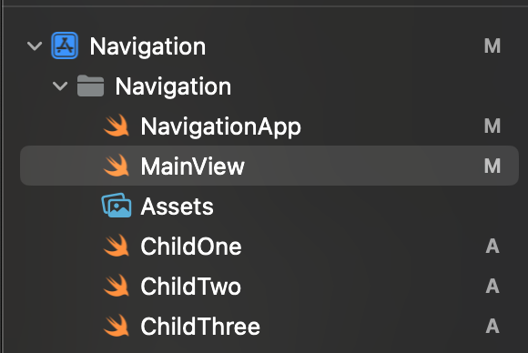
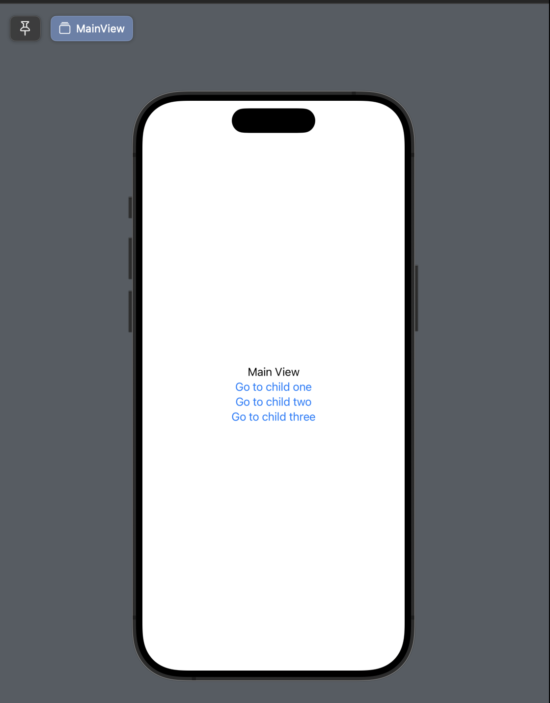
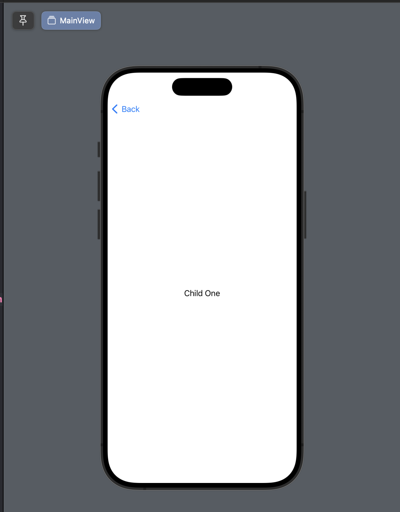
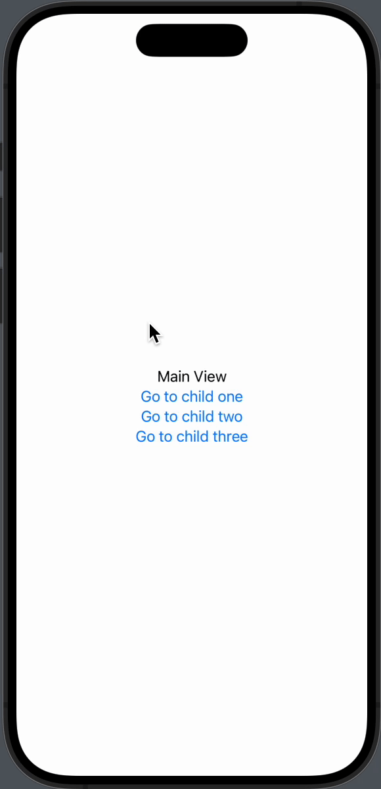

# An option for Navigation in SwiftUI

There are many ways to do Navigation in the SwiftUI framework, here I'm going to show you a way to work with navigation using `Enums`.


## Configuring Views

First, we are going to have some views in our project, each view will only have the title as a `Text` 



Inside each view we’ll only have this content for now

```swift
struct ChildOne: View {
    var body: some View {
        Text("Child One")
    }
}
```

Now, the idea is to have an `enum` that conforms the protocol `Hashable` that helps us to move around between views on our project

```swift
enum NavigationEnum: Hashable {
    case childOne
    case childTwo
    case childThree
}
```

<aside>
💡

## Why do you need `Hashable` protocol?

Okay, the short answer would be that NavigationDestination ask you to use it.

The long answer would be that SwiftUI need `Hashable` in this case to uniquely identify the data type that is being received. Conforming `Hashable` protocol, generates a unique hash value that SwiftUI can use internally to differentiate between destinations. If you're using a `NavigationStack` with a `NavigationPath`, SwiftUI stores and compares these hash values to manage the navigation history efficiently.

</aside>

## Now, configuring the MainView

We need to set up the `NavigationStack` and the `.navigationDestination` in our MainView

Also we need the NavigationLinks to tell the NavigationStack where we need to go.

In the `NavigationLinks` we can set the enum case we want to go.

```swift
NavigationLink(value: NavigationEnum.childOne) {
    Text("Go to child one")
}
```

We need a NavigationPath() in case we need to modify it or append a NavigationDestination to it 

```swift
@State var mainPath = NavigationPath()
NavigationStack(path: $mainPath) { }
```

The completed code should be something like this

```swift
struct MainView: View {
    @State var mainPath = NavigationPath()
    var body: some View {
        NavigationStack(path: $mainPath) {
            VStack {
                Text("Main View")
                NavigationLink(value: NavigationEnum.childOne) {
                    Text("Go to child one")
                }
                NavigationLink(value: NavigationEnum.childTwo) {
                    Text("Go to child two")
                }
                NavigationLink(value: NavigationEnum.childThree(object: SomeObject())) {
                    Text("Go to child three")
                }
            }
            .padding()
            .navigationDestination(for: NavigationEnum.self) { nav in
                switch nav {
                case .childOne:
                    ChildOne()
                case .childTwo:
                    ChildTwo()
                case .childThree(let object):
                    ChildThree()
                }
            }
        }
    }
}
```

I’m adding the case in childThree enum case, so the updated code for `NavigationEnum` looks like this.

```swift
enum NavigationEnum: Hashable {
    case childOne
    case childTwo
    case childThree(object: SomeObject)
}

struct SomeObject: Hashable {}
```

The `SomeObject` struct should also conforms the `Hashable` protocol in order for it to be used inside the `enum` .

## Our final View

Our View at the end should look like this



When pressing in one of the buttons, we can be able to move around our views.



We can add other buttons inside our Child Two view to navigate to others Views using the same .navigationDestination, it works because it inheriting the parent `NavigationStack`.

```swift
struct ChildTwo: View {
    var body: some View {
        VStack {
            Text("Child Two")
            NavigationLink(value: NavigationEnum.childThree(object: SomeObject())) {
                Text("Go to child three")
            }
        }
        
    }
}
```

## Final approach

Here if a gif of what we have, you can find the repo here in Github.


